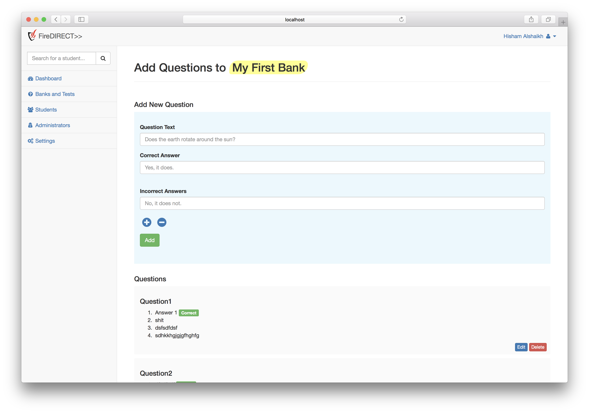

# Multiple-Choice-Tests-Management-MCTM

## Summary
This is a web application I have developed for a training company in Saudi Arabia. The application was built with Laravel Framework.

## Images

#### Admin Side

Figure 1. Dashboard.

Figure 2. Question banks and tests.

Figure 1. Adding questions to the bank.

Figure 1. View test.

Figure 1. Test settings.

Figure 1. Students.

Figure 1. View student.

### Student Side

Figure 1. Dashboard.

Figure 1. Completed Tests.

Figure 1. Student Test.
